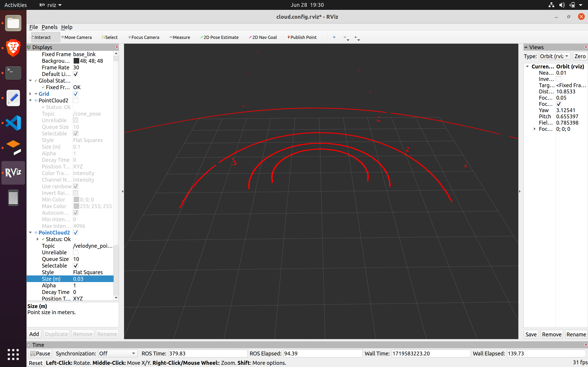
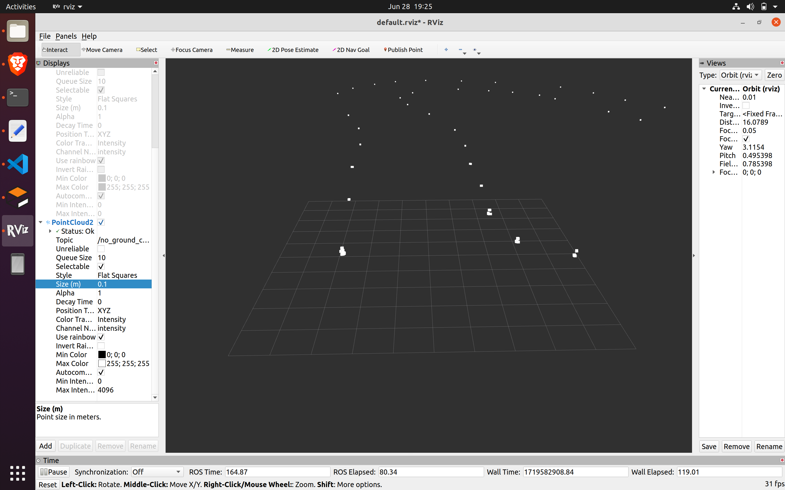
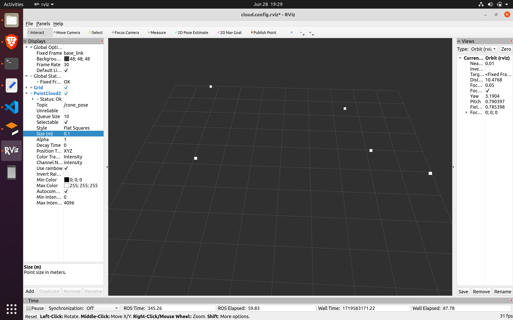

# Formula Student Driverless: Perception using lidar on EUFS sim
This repository aims to acheive 3D coordinates of cones placed on racetrack in Edinburg University Formula Student Simulator using a lidar pointcloud. <br />
**Lidar used is:** Velodyne VLP-16R (5 layers) <br />
**ROS version:** ROS Noetic <br />
**Ubuntu:** 20.04 <br />


### Raw output of lidar


### After ground removal


### Final Coordinates

 <br />

## Installation

### 1. Downloading EUFS simulator 
```
sudo apt-get install ros-noetic-ackermann-msgs
⁠sudo apt-get install ros-noetic-twist-mux
⁠sudo apt-get install ros-noetic-joy
sudo apt-get install ⁠ros-noetic-controller-manager 
sudo apt-get install ⁠ros-noetic-velodyne-simulator 
⁠sudo apt-get install ros-noetic-effort-controllers 
⁠sudo apt-get install ros-noetic-velocity-controllers 
⁠sudo apt-get install ros-noetic-joint-state-controller 
sudo apt-get install ⁠ros-noetic-gazebo-ros-control
⁠sudo apt-get install ros-noetic-hector-gazebo-plugins
cd catkin_ws/src
git clone https://github.com/eufsa/eufs_sim
⁠cd .. 
⁠catkin_make
```

Now change the first line of the following from python to python3:
```
gedit src/eufs_sim/robot_control/nodes/twist_to_ackermannDrive.py
```

Now you should be able to do: <br />
```
roslaunch eufs_gazebo small_track.launch
```
and see the car in its environment. <br />

In another terminal window, you can also do <br />
```
roslaunch robot_control rqt_robot_control.launch
```
to control the car using slider joystick <br />

### 2. Setting up this lidar package
```
sudo apt update
sudo apt-get install ros-noetic-pcl-conversions
sudo apt-get install ros-noetic-pcl-ros
sudo apt-get install python3-pip
pip3 install open3d
pip3 install cython
sudo apt update
sudo apt install python3-pcl
```

go to location: /usr/lib/python3/dist-packages. Then copy the folders “pcl” and “python_pcl-0.3.egg-info”. Go to Home then .local/lib/python3.8/site-packages. Delete the folder named “pcl”. Copy here the two folders from before. Restart the pc.

```
cd catkin_ws/src
git clone https://github.com/harshsrivastava0/lidar.git
chmod +x lidar/ground_removal/ransac3d_main.py
chmod +x lidar/clustering/cluster_extraction_dbscan.py
chmod +x lidar/pose_estimation/cone_pose.py
chmod +x lidar/cam_fusion/coordinate_transform.py
chmod +x lidar/cam_fusion/fusion.py
cd ..
catkin_make
```

## Execution

### 1. Without sensor fusion (of camera)

Now after launching a track in EUFS simulator. Start an empty terminal and launch: <br />
```
roslaunch ground_removal main.launch
```
The final coordinates of the cones are published on the topic /lidar_coordinate (**IMPORTANT: coordinates are given assuming lidar faces left**) <br />
You can view the coordinated using: <br />
```
rostopic echo /lidar_coordinate
```

To publish this, two custom message types arrofarr and arr have been used. The structure for which is present in lidar/clustering/msg

### 2. With sensor fusion

1. Launch eufs_simulator
```
roslaunch eufs_gazebo small_track.launch
```
2. Launch the yolo node available at link on the topic /zed/left/image_color
3. Uncomment the main.launch file present at lidar/ground_removal
4. Launch the main.launch file present at lidar/ground_removal
```
roslaunch ground_removal main.launch
```

You can view the coordinated using: <br />
```
rostopic echo /colored_cone
```
